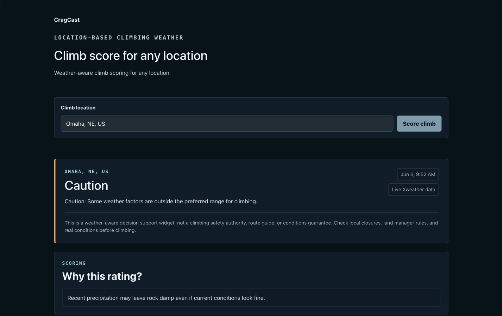

# CragCast



CragCast answers a practical question: are the weather conditions reasonable for a climb at a location right now or later today?

It is a one-page React, TypeScript, and Vite app built on Xweather APIs. The scope is intentionally small so developers can read the code, run it locally, and adapt the pattern to outdoor recreation, operations, field service, or event planning.

This is not a climbing safety authority, route guide, access source, or conditions guarantee. Climbers still need to check local closures, park rules, and real rock conditions before climbing.

## How it works

1. The user searches for a climb location.
2. `searchClimbLocations()` calls Xweather Places search and normalizes suggestions.
3. Selecting a location calls `fetchClimbWeather()`, which gathers current observations, hourly forecast, alerts, recent precipitation, optional threats, and optional Phrases context.
4. `getClimbingConditionScore()` evaluates the normalized data and returns a status, headline, and plain English reasons.
5. The UI renders the score, weather factor cards, and a narrative summary.

## Scoring logic

The scoring function is [`src/lib/climbingScore.ts`](src/lib/climbingScore.ts).

It returns `{ status, headline, reasons }` where status is one of:

- **No Go** — active severe or extreme alert, lightning or thunderstorm risk, or rain expected (≥30% chance in the next 6 hours)
- **Caution** — recent precipitation, wind over 25 mph, or temperature outside 35–90F
- **Good** — none of the above apply

The Phrases API summary is displayed as context only and does not affect the score.

## Xweather integration

The client lives in [`src/lib/xweather.ts`](src/lib/xweather.ts). The UI consumes a normalized `ClimbWeather` object instead of raw API responses.

Data sources:

- Places search — predictive location suggestions
- Observations — temperature, wind, current weather
- Hourly forecast — precipitation chance and near-term weather language
- Alerts — active severe weather
- Observation summary — recent precipitation
- Threats — lightning and thunderstorm risk
- Phrases API — plain English conditions summary

## Run locally

```bash
pnpm install
cp .env.example .env.local
```

Add your Xweather credentials to `.env.local`:

```
VITE_XWEATHER_CLIENT_ID=your_client_id
VITE_XWEATHER_CLIENT_SECRET=your_client_secret
VITE_USE_MOCK_WEATHER=false
```

```bash
pnpm dev
pnpm build
```

## Mock mode

If credentials are missing or `VITE_USE_MOCK_WEATHER=true`, the app renders realistic mock data so the demo stays usable before credentials are configured.

## Production credential note

This app uses `VITE_XWEATHER_CLIENT_SECRET` in the browser, which is fine for local exploration but exposes the secret in the built bundle. For production, proxy Xweather requests through a backend or serverless function. A production version should also cache responses and handle rate limits.

## Adapting this

- Change the default location in `src/data/sampleLocation.ts`.
- Tune thresholds in `src/lib/climbingScore.ts`.
- Update factor cards in `src/components/WeatherFactorGrid.tsx` to surface different risks.
- Swap the climbing framing for another use case: field service dispatch, parks operations, outdoor events, cycling, or trail work.

## Project structure

```
src/
  App.tsx
  main.tsx
  styles.css
  data/sampleLocation.ts
  lib/xweather.ts
  lib/climbingScore.ts
  components/ConditionCard.tsx
  components/LocationSearch.tsx
  components/WeatherSummary.tsx
  components/WeatherFactorGrid.tsx
  components/WhyThisRating.tsx
  components/DeveloperNotes.tsx
  types/weather.ts
```
